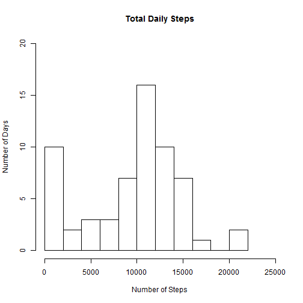
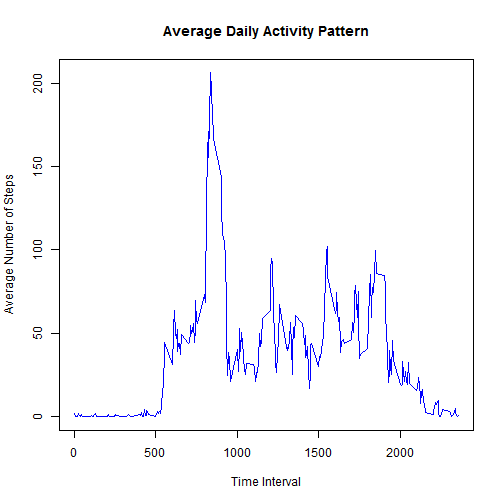
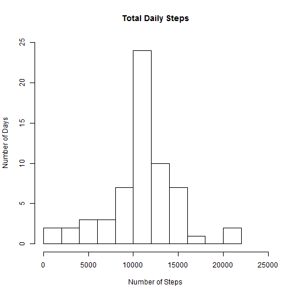
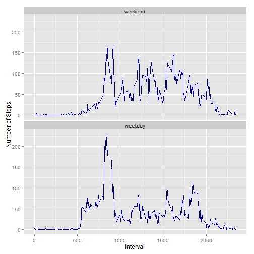

# Reproducible Research: Peer Assessment 1


## Loading and preprocessing the data


```r
#read in data
data <- read.csv("activity.csv",header=TRUE,na.strings="NA")
```

```
## Warning: cannot open file 'activity.csv': No such file or directory
```

```
## Error: cannot open the connection
```

## What is mean total number of steps taken per day?

```r
#sum steps by date
totalSteps <- tapply(data$steps,data$date,sum, na.rm=TRUE)

#make the histogram
hist(totalSteps,breaks=10,xlim=c(0,25000),ylim=c(0,20),xlab="Number of Steps",
     ylab="Number of Days",main="Total Daily Steps")
```

 

```r
#calculate mean and median
stepMean <- mean(totalSteps)
stepMedian <- median(totalSteps)

print(paste("Mean number of steps taken per day is",stepMean))
```

```
## [1] "Mean number of steps taken per day is 9354.22950819672"
```

```r
print(paste("Median number of steps taken per day is",stepMedian))
```

```
## [1] "Median number of steps taken per day is 10395"
```

## What is the average daily activity pattern?

```r
#calculate the average number of steps taken per interval across days
avg5minSteps <- tapply(data$steps,as.factor(data$interval),mean,na.rm=TRUE) 

plot(unique(data$interval),avg5minSteps,col="blue",xaxt="n", type="l", ylab="Average Number of Steps",
     xlab="Time Interval",main="Average Daily Activity Pattern")
axis(side=1,at=c(0,500,1000,1500,2000), labels=c("0","500","1000","1500","2000"))
```

 

```r
maxSteps <- max(avg5minSteps)
maxStepsIndex <- which(avg5minSteps == max(avg5minSteps))
interval <- data$interval[maxStepsIndex]

print(paste("The interval with highest average number of steps per day is",interval,"with a value of",maxSteps))
```

```
## [1] "The interval with highest average number of steps per day is 835 with a value of 206.169811320755"
```

## Imputing missing values
#### I will be replacing the missing values with the interval mean.

```r
#calculate and report number of missing values
nas <- is.na(data$steps)
naIndexes <- which (nas ==TRUE)
naCount <- length(naIndexes)
print(paste("The total number of NA values is",naCount))
```

```
## [1] "The total number of NA values is 2304"
```

```r
#I am replacing the NA values with the interval mean
data2 <- data
for (i in 1:length(naIndexes)) {
    tempInterval <-data2$interval[naIndexes[i]]
    intervalIndex <- which(unique(data$interval)== tempInterval)
    data2$steps[naIndexes[i]] <- avg5minSteps[intervalIndex]
}

totalStepsNA <- tapply(data2$steps,data2$date,sum)

hist(totalStepsNA,breaks=10,xlim=c(0,25000),ylim=c(0,25),xlab="Number of Steps",
     ylab="Number of Days",main="Total Daily Steps")
```

 

#### Replacing missing values does increase the number of steps per day and in the histogram it has changed the number of days with just above 10000 steps from around 16 to nearly 25.

```r
#calculate mean and median
stepMeanNA <- mean(totalStepsNA)
stepMedianNA <- median(totalStepsNA)

print(paste("Mean number of steps taken per day",stepMeanNA))
```

```
## [1] "Mean number of steps taken per day 10766.1886792453"
```

```r
print(paste("Median number of steps taken per day",stepMedianNA))
```

```
## [1] "Median number of steps taken per day 10766.1886792453"
```
#### When using the mean for the 5-minute interval to replace NAs it increases the mean and median values.

## Are there differences in activity patterns between weekdays and weekends?

```r
#add factor variable
data2$daytype <- factor(data2,levels=c("weekend","weekday"))

#determine what days were a weekday and what days were a weekend

#load this library so we can use is.weekend()
library(chron)

#set the values for weekend/weekday
for (i in 1:nrow(data2)) {
    if (is.weekend(as.Date(data2$date[i])))
        data2$daytype[i] <- "weekend"
    else
        data2$daytype[i] <- "weekday"
}

#subset so we can get the avgerage for each interval
weekdays <- data2[data2$daytype == "weekday",]
weekends <- data2[data2$daytype == "weekend",]

#calculate average for each interval
avg5minStepsWD <- tapply(weekdays$steps,as.factor(weekdays$interval),mean)
avg5minStepsWE <- tapply(weekends$steps,as.factor(weekends$interval),mean) 

#making a new data frame so we can make a plot like the example in the assignment

#get interval list
intervalList <- unique(data2$interval)

#make data frames for weekdays and weekends
wd <- data.frame(avg5minStepsWD,intervalList)
we <- data.frame(avg5minStepsWE,intervalList)

#fix names
names(wd) <- c("avg5minSteps","Interval")
names(we) <- c("avg5minSteps","Interval")

#combine into one
wewd <- rbind(we,wd)

#readd factor variable and set it correctly, first 288 rows are the weekend averages, next 288 are weekday averages
wewd$daytype <- factor(data2,levels=c("weekend","weekday"))
wewd$daytype[1:288] <- "weekend"
wewd$daytype[289:576] <- "weekday"

library(ggplot2)

#make the plot and print it
p <- ggplot(wewd,aes(Interval,avg5minSteps)) + facet_wrap(~ daytype,ncol=1) + geom_line(colour ="#000099") 
p <- p + ylab("Number of Steps")
print(p)
```

 
